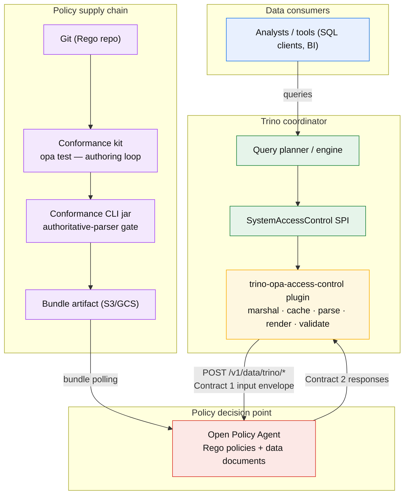
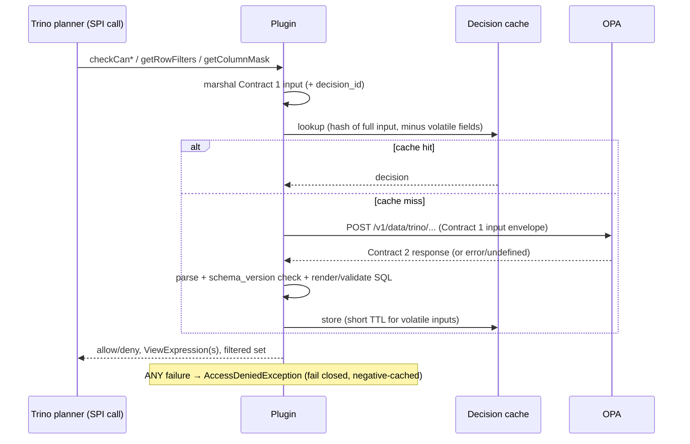
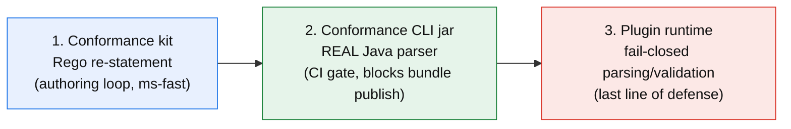
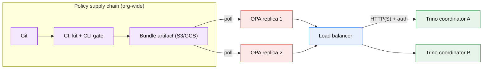
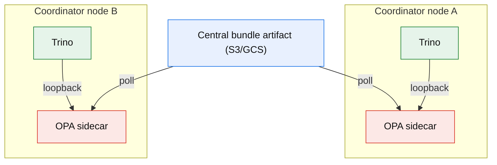

# Trino-OPA Access Control — Architecture

> **Snapshot discipline.** This document describes the system **as built**:
> target state as of **response `schema_version` 1, Trino SPI 474**.
>
> - Normative wire-level interface specs (Contracts 1–5, §3.1–§3.5) →
>   [`CONTRACTS.md`](CONTRACTS.md) — the clause anchors cited in conformance-gate
>   failures live there.
> - Status, decisions (D-items), pending work → [`ROADMAP.md`](ROADMAP.md)
>   (single source of truth; where this document conflicts with ROADMAP or the
>   code, **they win**).
> - Deployer-facing behavior (config quickstart, staleness bounds, identity
>   sources) → [`../README.md`](../README.md).
> - Per-method SPI mapping → [`SPI-COVERAGE.md`](SPI-COVERAGE.md).
>   Implementation deviations → [`IMPLEMENTATION-NOTES.md`](IMPLEMENTATION-NOTES.md).

## 1. Project Overview & Mission

This project provides a generic, highly scalable, and vendor-agnostic
`SystemAccessControl` plugin for Trino. It delegates authorization decisions,
dynamic row-level security (HBAC/ABAC), and column-level data masking
(PII/pseudonymization) to Open Policy Agent (OPA) via policy-as-code.

By keeping the Java plugin strictly domain-agnostic, organizations can enforce
complex security models — hierarchical inheritance, tenant boundaries, dynamic
redactions — directly in declarative Rego policies without recompiling or
redeploying Trino coordinator nodes.

> **Trust model (read first).** OPA is a **hard trust boundary**. Every
> authorization decision the plugin enforces originates as OPA output, so a
> compromised, misconfigured, or buggy policy can silently grant or deny
> access. The remainder of this document assumes that:
> - OPA policies and bundles are version-controlled, reviewed, and signed.
> - The plugin fails **closed** whenever OPA is unreachable, malformed, or slow (§7).
> - Defense-in-depth is applied to all OPA-emitted SQL (Contract 4).
>
> This trust model is the single most important invariant in the system.
> Everything else (caching, contracts, resilience) exists to preserve
> correctness *without* weakening it.

## 2. Core Architecture

### 2.1 Components



### 2.2 Request flow



### 2.3 Separation of concerns

1. **Trino (compute engine):** parses queries, requests access control
   decisions, applies SQL rewrites into the logical AST, executes compute.
2. **Trino-OPA plugin (bridge):** translates SPI context into JSON
   (`CONTRACTS.md` §3.1), caches decisions safely, translates responses into
   SPI return types. **No policy logic.**
3. **OPA (policy decision point):** evaluates ABAC attributes, hierarchical
   lookups (HBAC), and emits decisions — raw SQL (passthrough) or structured
   descriptors (safe mode).

### 2.4 The contract-enforcement stack (three layers, one contract)

The same Contract-2 schema is enforced three times, by three independent
implementations — this is deliberate defense-in-depth and the reason
plugin/policy version skew is caught before deployment:



The CLI gate is the strongest link for skew: because it runs the *authoritative
parser*, a policy conforming to yesterday's contract fails against a new jar
before deployment, and vice versa (simulable via `--schema-version`).

### 2.5 Deployment topologies

These are the supported topology patterns (recorded as decisions in
`ROADMAP.md` § Deployment assumptions). Concrete packaging recipes (k8s
manifests, sizing, TLS termination) are Milestone-7 scope.

**Pattern A — central OPA fleet (recommended starting point).** One HA OPA
deployment serves all coordinators behind a load balancer. Simplest to operate;
one bundle rollout reaches every cluster at once.



**Pattern B — per-coordinator sidecars (lowest latency).** An OPA daemon on
each coordinator node, loopback HTTP; all sidecars poll the *same* central
bundle artifact, keeping the artifact model reversible.



**Choosing between them:** Pattern A minimizes operational surface (one fleet
to monitor, one place to tune); Pattern B removes the network hop from the
authorization critical path and isolates coordinator availability from the
shared fleet — at the cost of N OPA instances to run and monitor. Either way:
OPA availability is on the query critical path (fail-closed), so whichever
serves a coordinator must be HA; decision calls are read-only and idempotent,
so load balancing is trivial. Because every OPA polls the same bundle
artifact, the choice is **reversible** — the plugin only requires one or more
HTTP endpoints speaking the contract.

| Aspect | A: central fleet | B: sidecars |
|---|---|---|
| Added authorization latency | ~1–5 ms network hop | < 0.5 ms loopback |
| Operational surface | 1 HA fleet | N daemons |
| Blast radius of an OPA outage | all coordinators | one coordinator (its own sidecar) |
| Bundle rollout | one fleet to roll | all sidecars poll the same artifact |
| Best fit | small/medium fleets, standardization | latency-sensitive, large fleets |

## 3. Interface contracts (summary)

The wire-level contracts are normatively specified in
[`CONTRACTS.md`](CONTRACTS.md) — the section anchors §3.1–§3.5 are preserved
there and are cited verbatim in conformance-gate failure messages.

| Anchor | Contract | One line |
|---|---|---|
| §3.1 | Context marshaling | everything the plugin knows → `input` JSON, `schema_version`-tagged |
| §3.2.A | Authorization responses | boolean or per-column map; undefined rule = deny |
| §3.2.B | Row filters | SQL strings (passthrough) or descriptors (safe); undefined = error |
| §3.2.C | Column masks | SQL string / descriptor / null; undefined = error |
| §3.2.D | Bulk filtering | allow-listed subset of candidates; empty = allow nothing; absent = error |
| §3.3 | SQL injection | emitted SQL is Trino-specific |
| §3.4 | SQL validation / safe mode | structural validation in both modes; descriptors in safe mode |
| §3.5 | Schema versioning | unknown version fails closed; additive bumps |

## 4. Policy patterns: hierarchical access control (HBAC)

Hierarchical access control is solved entirely within Rego using OPA data
collections (organizational trees, cost-center parents, department graphs),
preventing Trino from needing LDAP/Active Directory plugins. The reference
pattern is **true recursive traversal** of a `parent`/`children` graph,
returning every node reachable from the user's groups:

```rego
package trino.row_filters

import rego.v1

default result := []

# Roots: the units directly associated with the user's groups.
roots[unit] if {
    some group in input.identity.groups
    unit := data.hierarchy_nodes[group][_]
}

# Reachable: a unit is authorized if it is a root or a descendant of a root.
authorized_units[unit] if unit := roots[_]

authorized_units[unit] if {
    some parent in roots
    reachable(parent, unit)
}

reachable(node, unit) if unit := data.children[node][_]

reachable(node, unit) if {
    some child in data.children[node]
    reachable(child, unit)
}

# Emit a *structured* filter and let the plugin render the SQL (safe mode).
result := [{"op": "in", "column": "org_unit_id", "values": sort(authorized_units)}] if {
    input.resource.schema == "enterprise"
    input.resource.table == "sales_records"
    count(authorized_units) > 0
}
```

Correctness rules:

- **Traversal must be recursive** to actually walk the hierarchy; a
  single-level map lookup is not hierarchy traversal.
- **Escaping is the plugin's job in safe mode.** In passthrough mode, unit IDs
  must be escaped (`''` doubling) so a value containing a single quote cannot
  break or inject SQL.
- **Avoid `sprintf`-built unbounded `IN (...)` lists.** Return structured
  values and let the plugin bound the clause (`opa.sql.max-in-clause-size`).

## 5. SystemAccessControl SPI coverage (summary)

The plugin implements the full `SystemAccessControl` matrix (Trino 474): every
method is either routed to OPA via an `action` string and an OPA path, or
**explicitly default-denied** (fail closed, audited, metric-tagged). The
authoritative per-method table — including the Trino 474 method-name realities
(`canAccessCatalog`, `getColumnMask` single-column form, factory signature) —
lives in [`SPI-COVERAGE.md`](SPI-COVERAGE.md).

Notable shapes:

- `checkCanSelectFromColumns` marshals the requested columns into
  `resource.columns`; OPA answers with a boolean or a per-column allow/deny map.
- `getRowFilters` returns `List<ViewExpression>`; `getColumnMask` returns
  `Optional<ViewExpression>`; both are structurally validated before injection.
- The `Type` parameter of `getColumnMask` enables type-aware masking.

## 6. Performance, scale & caching

Trino calls `getRowFilters` / `getColumnMask` during semantic analysis for
every referenced table and column; synchronous network calls need safeguards.

### 6.1 High-throughput guidelines

1. **Co-locate OPA** (sidecar / local daemon on the coordinator, loopback
   HTTP): round-trip drops from ~5–20 ms to < 0.3 ms.
2. **In-memory decision cache** with the correct key (§6.2).
3. **Keep context lightweight:** do not pass deep org trees in `input`; sync
   org graphs to OPA bundles as data documents.
4. **Avoid giant filter SQL strings:** bound `IN (...)` sizes
   (`opa.sql.max-in-clause-size`, default 1000) or push toward partitioned
   tenant keys.
5. **Batch column-mask evaluation** for wide tables (backlog item): N
   round-trips → one.

### 6.2 The correct cache key

The cache key **must** capture every input field a policy may branch on. Using
only `(User, Catalog, Schema, Table, Column, Action)` is unsafe — policies can
depend on `groups`, `roles`, `client_tags`, `source_ip`, and session
properties.

**Implemented key:** the canonical hash (stable field ordering, sorted
lists/maps) of the **full marshaled `input`**, excluding volatile fields
(`query_id`, `decision_id`, timestamps, `*_time`-named session fields).

Additional implemented guidance:

- **Separate short-TTL cache** for decisions whose input populates a volatile
  field (`opa.cache.volatile-fields`, default `source_ip,catalog_session_properties`).
- **Negative caching** with a short TTL so a failing OPA is not hammered.
- **Determinism contract:** policies must be pure functions of their
  non-volatile `input`. Non-deterministic builtins (`time.*`, `http.send`,
  `rand.*`, `opa.runtime`) break caching; the kit will carry a warning-level
  scanner for them (ROADMAP M7/D4).

### 6.3 Resilience & availability

- **Fail closed** on any OPA error, non-200, timeout, or malformed response (§7).
- **Retry with jitter** for transient failures (read-only, idempotent calls).
- **Circuit breaker** (CLOSED/OPEN/HALF_OPEN) to keep a degraded OPA from
  cascading latency into query planning.
- **Multi-coordinator consistency:** each coordinator's cache is local; rely on
  TTL for eventual consistency and coordinate bundle versions via GitOps
  rollouts (§8.1).

### 6.4 Latency budget

End-to-end authorization should stay within a few milliseconds on the cached
path: cache hit < 1 ms; co-located OPA round-trip < 0.3 ms (+ policy eval);
fail-closed fast-fail bounded by `opa.client.timeout-ms`.

## 7. Fail-closed security (first-class invariant)

The plugin **always fails closed**. Concretely, each of these denies the
operation:

- OPA unreachable / timeout / non-200 / OPA error envelope / malformed body
- unsupported or missing response `schema_version` (Contract 5)
- response shape violations of Contract 2 (wrong types, absent `result` on
  list/mask paths, non-scalar descriptor values, oversized `IN`)
- SQL that fails structural validation (Contract 4)
- any `checkCan*` method with no matching OPA rule (explicit default-deny)

> Fail-closed is a **security property, not an availability convenience**.
> Operators must provision OPA for high availability (§8.2): a fail-closed
> system with an unhealthy PDP becomes unavailable — by design.

## 8. Operations

### 8.1 GitOps policy pipeline

- Validate all Rego with `opa test` (the conformance kit) **and** the
  conformance CLI jar in CI; both green → bundle publishable.
- Sign bundles and roll them out atomically; keep a single bundle version per
  OPA instance so decisions are consistent.

### 8.2 OPA high availability

- Run multiple OPA instances behind a load balancer, or co-located sidecars per
  coordinator (§3 topology).
- Prefer consistent bundle versions across replicas so one query does not
  observe inconsistent policy decisions.
- Configure liveness/readiness probes; the plugin's circuit breaker should open
  before a failing OPA saturates query planning.

### 8.3 Audit logging

Log the final applied SQL masks and filters (and the `decision_id`) via Trino
event listeners for regulatory compliance (GDPR, HIPAA, SOC 2). Scheduled as
Milestone 8 (see `ROADMAP.md`).

### 8.4 Observability & decision correlation

Emit a **`decision_id`** per SPI call, echoed by OPA and logged by both sides.
Publish: decision latency (hit/miss), decisions by outcome, fail-closed count
(leading PDP-health indicator), OPA error kinds, circuit-breaker state, and
per-cache size/eviction gauges (`opa.cache.size`, `opa.cache.evictions` — D5).
The deployer-facing metric table (names, tags, meanings) is in `README.md`
§ Observability.

### 8.5 Security hardening

- Bearer-token auth or TLS (PKCS12 truststore) between plugin and OPA when the
  PDP is not on loopback; secrets via `file://` references only.
- Schema-validate every OPA response (Contract 5).
- Apply safe mode / SQL validation (Contract 4).
- Treat OPA and its bundle supply chain as a hard trust boundary (§1).

## 9. Plugin configuration reference

Place in `etc/access-control.properties` on the Trino coordinator (defaults
shown; the plugin fails fast on unknown/invalid values):

```properties
access-control.name=opa-access-control
opa.endpoint.url=http://127.0.0.1:8181

# Policy paths (override the action -> path convention; see SPI-COVERAGE.md)
opa.policy.allow.path=/v1/data/trino/allow
opa.policy.row-filters.path=/v1/data/trino/row_filters
opa.policy.column-masks.path=/v1/data/trino/column_masks
opa.policy.filter.path=/v1/data/trino/filter

# HTTP client
opa.client.timeout-ms=250
opa.client.max-connections=100
opa.client.max-connections-per-route=50
opa.client.retry-max=2
opa.client.retry-backoff-ms=50

# Security
opa.client.tls.enabled=false
opa.client.tls.truststore.path=/etc/trino/opa-truststore.p12
opa.client.auth.token=file:///etc/trino/opa-token

# SQL validation / mode
opa.sql.mode=safe                # default (D6); or "passthrough" as an explicit opt-in
opa.sql.parser.enabled=true
opa.sql.allowed-functions=          # empty = unrestricted
opa.sql.max-in-clause-size=1000

# Cache
opa.cache.enabled=true
opa.cache.ttl-seconds=30
opa.cache.max-size=50000
opa.cache.negative-ttl-seconds=2
opa.cache.volatile-fields=source_ip,catalog_session_properties

# Resilience
opa.circuit-breaker.enabled=true
opa.circuit-breaker.failure-threshold=10
opa.circuit-breaker.open-duration-ms=10000
```

## 10. Status & evolution

Where the system goes next — decisions, milestones, and the backlog
(embeddable PDP, batch mask evaluation, mTLS, safe-mode default flip D6,
audit-logging M8) — is tracked exclusively in [`ROADMAP.md`](ROADMAP.md).
This document is updated when the *target state* moves, not when work is
scheduled.

## 11. Coexistence with a query-cost proxy (EXPLAIN IO / SQL-text gate)

Some deployments front Trino with a **reverse proxy** whose job is *resource
governance*, not data access. It inspects raw SQL text (e.g. detects
`SELECT *` or missing partition predicates) and/or calls `EXPLAIN` /
`EXPLAIN (TYPE IO)` to estimate scan cost / CPU, blocking queries that would
hog the cluster.

This layer is **orthogonal** to the OPA plugin (which governs *access* — rows,
columns, masks, HBAC), so the two coexist cleanly. The following interaction
points should be verified before enabling OPA in such an environment.

### 11.1 Whitelist the proxy's identity for `EXPLAIN`

The proxy issues `EXPLAIN` / `EXPLAIN IO` (and possibly `SHOW`) under a service
identity. If OPA has no `allow` rule for that identity, those calls fail closed
and the proxy receives no plan — breaking the proxy or, worse, causing it to
fail open. **Before enabling OPA**, give the proxy a dedicated principal or
client tag and write explicit Rego rules allowing `EXPLAIN`, `SHOW`, and
`SELECT_FROM_COLUMNS` across the catalogs it inspects.

### 11.2 Masks and row filters rewrite the plan the proxy measures

OPA rewrites the plan during analysis, which shifts the cost signals the proxy
is calibrated to:

- **Row filters** inject predicates that may *lower* reported scan cost
  (partition pruning), so the proxy can under-block a query whose estimate
  dropped.
- **Column masks** replace a column with a `CASE`/function expression, slightly
  raising CPU estimate and, if a mask reads a lookup table, adding I/O.

Re-tune scan/CPU thresholds after masks and filters are live.

### 11.3 Identity-dependent filters/masks and plan fidelity

If row filters or masks depend on `current_user()` / session context (common in
HBAC), then an `EXPLAIN` run **under the proxy's own service identity**
reflects that identity's plan — not the plan the real end-user query will
execute. For cost estimation this is a fidelity gap: the proxy's scan-cost
number may not match what the user's query actually does. Confirm whether the
proxy explains as the end user or as a service account, and account for the
difference.

### 11.4 Fail-closed OPA couples availability to the proxy

An OPA outage makes queries fail closed, which also blinds the proxy's
`EXPLAIN` path (same identity, same PDP). Mitigate with OPA HA and a circuit
breaker (§6.3, §8.2) so a PDP degradation does not cascade into both query
denial *and* proxy blindness.

### 11.5 `SELECT *` detection

- **Raw SQL-text based detection** (the common case): unaffected by OPA; masks
  do not change the literal `SELECT *` in the submitted text.
- **Plan/column-list based detection**: masks may alter the effective
  projection, so confirm the detector reads the input it expects.
